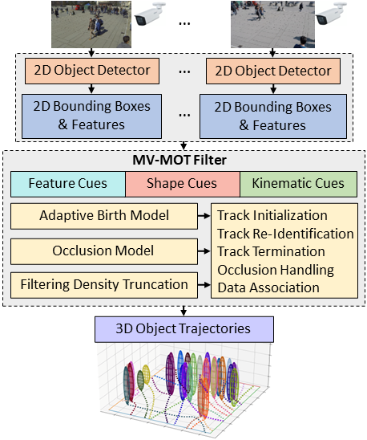

# 3D Visual Tracking with 2D Bounding Box Detection

This is the C++ implementation (with Python wrapper) for the paper:
```
@article{linh2024inffus,
      title={Track Initialization and Re-Identification for {3D} Multi-View Multi-Object Tracking}, 
      author={Linh Van Ma and Tran Thien Dat Nguyen and Ba-Ngu Vo and Hyunsung Jang and Moongu Jeon},
      journal={Information Fusion},
      year={2024},
      pages={102496},
      publisher={Elsevier}
}
```
A pre-print version of the article is available at http://arxiv.org/abs/2405.18606.

The original source codes are published at https://github.com/linh-gist/3D-Visual-MOT by Linh Ma (linh.mavan@gm.gist.ac.kr), Machine Learning & Vision Laboratory, GIST, South Korea.

### !!! News !!!
19/12/2024:
- C++ implementation of (the faster) LMB filter is released, check it out [here](https://github.com/TranThienDat-Nguyen/3D-VisualTracking/blob/main/cpp_ms_glmb_ukf/src/run_filter_lmb.hpp) !!!
 
22/10/2024:
- Python & C++ implementations of GLMB Filter for 2D Visual Tracking is released [here](https://github.com/linh-gist/VisualRFS) !!!
- Python implementation of GLMB and LMB filters (including the multi-sensor GLMB filter) are released [here](https://github.com/linh-gist/labeledRFS) !!!

### Quick Overview
The algorithms estimate 3D tracks (3D SHAPES + 3D POSITION) from 2D bounding box detection.
<div align="center">
	
</div>

### System Installation (require Docker)
Download the Docker image at [Docker Hub](https://hub.docker.com/r/isplcurtin/mv-glmb-ab).
- Clone this repository:
    ```sh
    git clone https://github.com/TranThienDat-Nguyen/3D-VisualTracking.git
    # or alternatively: gh repo clone TranThienDat-Nguyen/3D-VisualTracking
    ```
- Follow instructions [here](https://docs.docker.com/engine/install/) to install docker on your host computer.
- Run this repo via `docker` command from the `main source code` directory: 
    ```bash
    cd 3D-VisualTracking
    docker run -d -t --rm --name 3D-VisualTracking -p 8888:8888   -v $(pwd):/workspace:Z  isplcurtin/mv-glmb-ab:latest
    docker exec -it 3D-VisualTracking bash
    ```
The docker also supports running codes via [browser](http://localhost:8888) with login password `abc123`. 

### Preparing Data
 - Download the datasets: 
    - CMC datasets (CMC1, CMC2, CMC3, CMC4, CMC5) can be downloaded from [Google Drive](https://drive.google.com/file/d/1eliDg_DTHqgW10ww7aQWvicAwP3hlVEo/view?usp=sharing or [MEGA CLOUD, NZ](https://mega.nz/file/LKxAyZiT#wa-aMQmgk9guNkjj1olaPeUf-LgPS5P9iYBmZSLFnp8).
    - WILDTRACK dataset is available at [EPFL CVLAB](https://www.epfl.ch/labs/cvlab/data/data-wildtrack/).
    - Download data [here](https://drive.google.com/file/d/1VYC6iOFyN2WAoA0JB0dzXbIlYPabC34t/view?usp=sharing).
- Create a `data` folder and place the downloaded data in there using the following structure
    ```
    |-- source code
    |   |-- data
    |   |   |-- images
    |   |   |   |-- CMC1
    |   |   |   |   |-- Cam_1
    |   |   |   |   |-- Cam_2
    |   |   |   |   |-- Cam_3
    |   |   |   |   |-- Cam_4
    |   |   |   |-- ...
    |   |   |   |-- CMC5
    |   |   |   |-- WILDTRACK
    |   |-- cpp_ms_glmb_ukf
    |   |-- detection
    |   |   |-- cstrack
    |   |   |   |-- CMC1
    |   |   |   |   |-- Cam_1.npz
    |   |   |   |   |-- Cam_2.npz
    |   |   |   |   |-- Cam_3.npz
    |   |   |   |   |-- Cam_4.npz
    |   |   |   |-- CMC2
    |   |   |-- fairmot
    |   |-- experiments
    |   |-- ms_glmb_ukf
    |   |-- README.md
    ```
### Default 2D Detection
- We provide two sets of 2D detections (for all cameras) for all datasets.
	- FairMOT (https://github.com/ifzhang/FairMOT) detection is available at `../detection/fairmot/`.
	- CSTrack ([https://github.com/JudasDie/SOTS](https://github.com/JudasDie/SOTS/blob/MOT/CSTrack/lib/tutorial/CSTrack/cstrack.md)) detection is available at `../detection/cstrack/`.
- Note:
	- We re-trained the original models with CMC4 sequence (use [gen_labels_cmc.py](detection/fairmot/cmc/gen_labels_cmc.py) to obtain the training data).
### Using Your 2D Detection 
- To be updated
  
### Compiling Tracking Algorithm
- Navigate to `cpp_ms_glmb_ukf` folder.
- Chane line 11 in "main.cpp" to: ```#include "run_filter_glmb.hpp"``` for MV-GLMB-AB filer or to ```#include "run_filter_lmb.hpp"``` for the LMB filter.
- Run `python setup.py build develop`.

### Start Tracking Objects in 3D
- Navigate to `ms-glmb-ukf` folder.
- Modify parameters in the `demo.py`  file, follow the options available there.
- Run `python demo.py`.

### Sample Outputs from MV-GLMB-AB Algorithm


### Writing Your Tracking Algorithm
- To be updated.

### Acknowledgement
The source codes are published by Linh Ma (linh.mavan@gm.gist.ac.kr), Machine Learning & Vision Laboratory, GIST, South Korea.

The Docker image is provided by Dr Hoa Van Nguyen (https://github.com/nguyenvanhoa89).

The OSPA(2) metric used for evaluation is described in the paper:
```
@article{rezatofighi2020trustworthy,
  title={How trustworthy are the existing performance evaluations for basic vision tasks?},
  author={Tran Thien Dat Nguyen and Hamid Rezatofighi and Ba-Ngu Vo and Ba-Tuong Vo and Silvio Savarese and Ian Reid},
  journal={IEEE Transactions on Pattern Analysis and Machine Intelligence},
  year={2023},
  volume={45},
  number={7},
  pages={8538-8552}
}
```

